8月に会社を辞め、次の職場の出勤まで丸1ヶ月のおやすみ。無為に過ごすのもよくないのでとりあえずブログを立ち上げてみようと思いました。

ブログエンジンとしては、以前から業務にて使用していた静的サイトジェネレーターの「Hugo」を使い、かつNetlify CMSを用いてブラウザ上から記事の投稿もできるようにしてみます。


# Hugoとは？

Hugoは静的サイトジェネレーターの一種です。

静的サイトジェネレーターは、テキストファイルで用意した原稿を元にHTMLを生成するアプリケーションで、Wordpressなどと異なりサーバーにインストールする必要がなく、SQLなどのDBも使わないため手軽で、セキュリティ面でも有利なため、最近人気が高まっています。

テキストファイルで原稿を作成し、CUIでコマンドを実行すると原稿をもとにHTMLが生成されます。基本的には生成されたHTMLをWebサーバーにアップロードすることで利用しますが、NetlifyやCircleCIなどのCIサービスと組み合わせてGitからの自動デプロイを実行することが多いようです。

# Netlify CMSとは？

静的サイトジェネレーターは手軽な反面、コンテンツ管理という意味では貧弱ですし、GUIの記事作成画面も用意されないので、とっつきにくい部分もあります。CIサービスと組み合わせるならGitの知識も必要です。

そんな欠点を補うべく、静的サイトジェネレーターをWordpressなどの一般的なCMSライクに利用するためのソフトウェアが「Netlify CMS」です。Netlify CMSを利用することにより、HugoでもWebブラウザのGUIから記事投稿や画像アップロードが可能となります。

Netlify CMSは記事DB兼画像などのアップロード先としてGitHubのリポジトリを利用します(GitLab、Bitbucketも対応)。また、ホスティング先はNetlifyのサーバーを無料で利用できます。

Hugo + Netlify CMSの組み合わせなら、WebからワンクリックでGitHubへのインストール、およびNetlifyへのデプロイが可能です。今回はブログの作成、およびブログテーマの切り替え、そして簡単な投稿ができるまでを目安にやってみます。


# Hugo + Netlify CMSでブログを立ち上げる

HugoとNetlify CMSを使う場合、記事の投稿ができる状態のブログをあっという間に作成できる[スターターテンプレート](https://www.netlifycms.org/docs/start-with-a-template/)を利用できます。ボタンを押すと自動でGitHubのリポジトリ作成＆Netlify CMS設定＆Netlifyのホスティング連携までやってくれてブログ環境が瞬時に出来上がるので非常に楽です。


# セットアップ

Netlifyのアカウントを取得した上で、[スターターテンプレート](https://www.netlifycms.org/docs/start-with-a-template/)のページで「Hugo Site Starter」のところの「Deply to netlify」ボタンを押します。


デプロイ元のリポジトリを接続する画面になるので、右下の「Connect to GitHub」を押します。

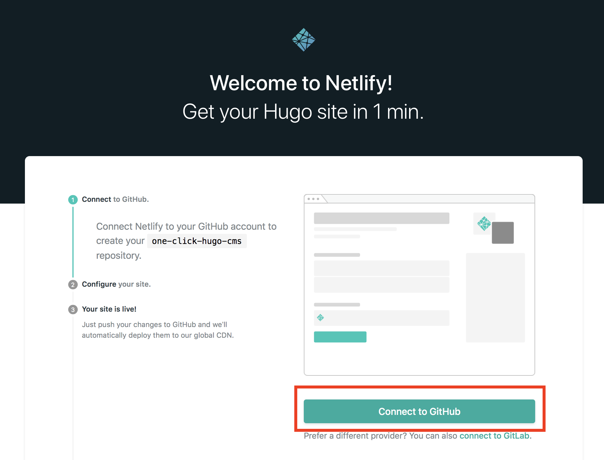

接続が終わると下記の画面に。リポジトリ名を入力して「Save & Deply」を押す。

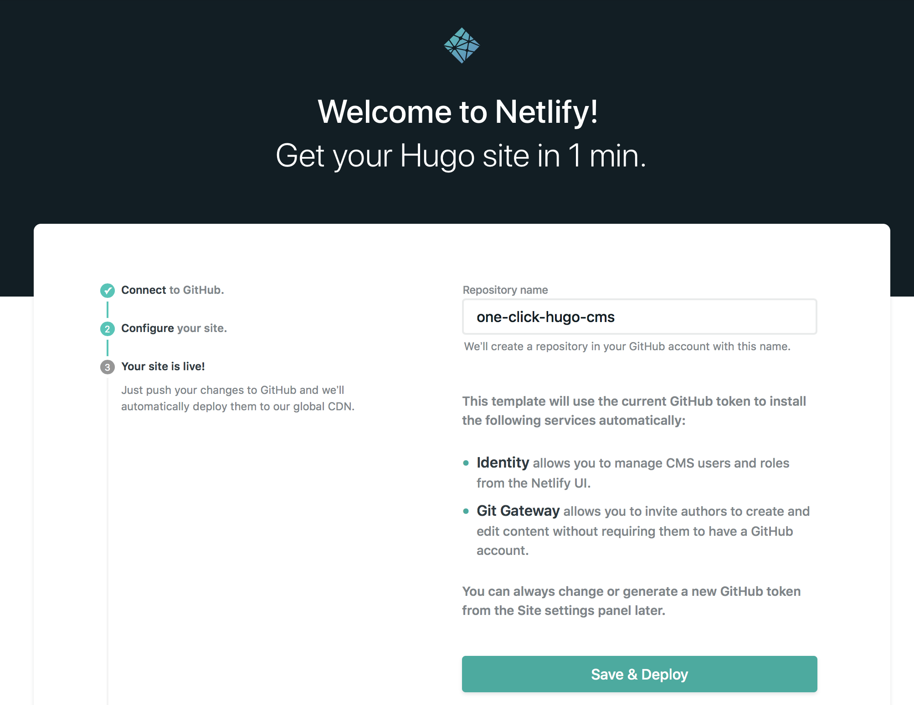

以上でほぼ完了。あとはGitHubのリポジトリに必要なファイル諸々が設置され、その後Netlify側にホスティングされます。


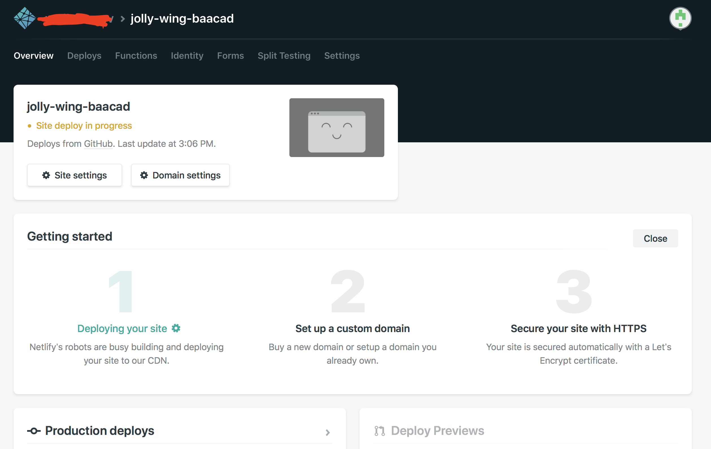

Netlify側のサイト名はランダムで決められているのでSite Settings→Change Site Nameにて修正しておくと良いでしょう。カスタムドメイン設定が必要ならDomain Settingsから行います。


# ブログできた

諸々処理が完了すると、ブログが完成。

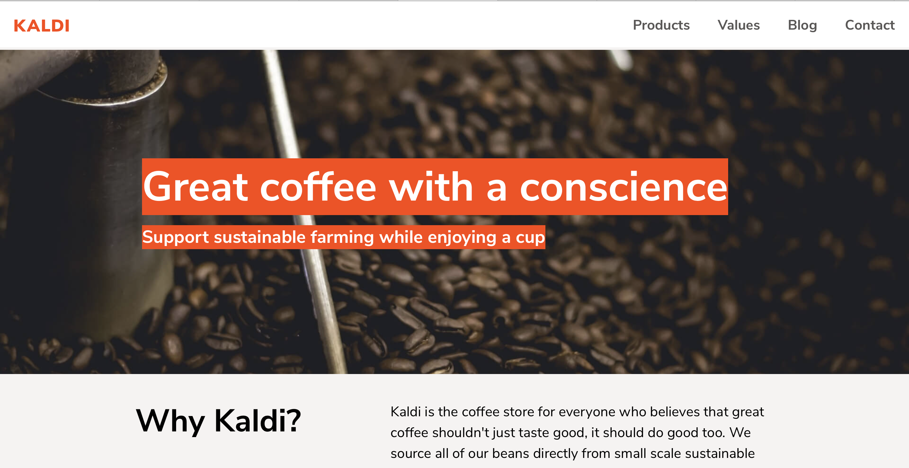

デフォルトでは謎のコーヒーファーム的テンプレートが使用されているので、修正が必要です。とりあえずテーマだけでも切り替えたいところ。

# デザインを変えてみる

とりあえず適当なHugoテーマを取ってきて適用してみましょう。

まずはサイトのリポジトリをclone。

```bash
> git clone git@github.com:YOURACCOUNT/YOURREPOSITORY
```

今回は、ミニマル、かつコードハイライトにも対応していていい感じのHugoテーマ[Hugo Bingo](https://themes.gohugo.io/hugo-bingo/)をありがたく使わせていただきます。Netlifyで作成したサイトにはthemesディレクトリがないので作成してからBingoのテーマを突っ込みます。

```bash
netlifycms_dir> cd site
netlifycms_dir> mkdir themes
netlifycms_dir> cd themes/
themes> git clone git@github.com:gundamew/hugo-bingo.git
themes> rm -rf hugo-bingo/.git/
```

site直下のlayoutsディレクトリを削除しないとうまくhugo-bingoを適用してくれないようなので、layoutsを消しつつ、設定ファイルとコンテンツもhugo-bingo/exampleSiteに入っているサンプルファイルを設置します。exapmleSite内のconfig.tomlとcontentをsite直下に上書き。content内のディレクトリ名「posts」はNetlify CMSの設定ファイルと食い違うので「post」に直しておきます。

```bash
site> rm -r layouts
site> cp themes/hugo-bingo/exapmleSite/config.toml config.toml
site> cp -r themes/hugo-bingo/exampleSite/content . 
site> mv content/posts content/post
```

あとは、日本語対応のためconfig.tomlも微修正しておきましょう。`languageCode = "zh-cmn-Hant"`は削除した上で、下記を追記します。

```toml:config.toml
isCJKLanguage = true
languageCode = "ja-jp"
```

これでtheme（とコンテンツ）がhugo-bingoにおきかわったはず。`hugo server`でローカルのWebサーバーが立ち上がるので、それで確認してみましょう。

```bash
site> hugo server
                   | EN
+------------------+----+
  Pages            | 11
  Paginator pages  |  0
  Non-page files   |  0
  Static files     | 54
  Processed images |  0
  Aliases          |  0
  Sitemaps         |  1
  Cleaned          |  0

Total in 150 ms
Watching for changes in /Users/yu/blog/yurik-hugo/site/{content,data,static,themes}
Watching for config changes in /Users/yu/blog/yurik-hugo/site/config.toml
Serving pages from memory
Running in Fast Render Mode. For full rebuilds on change: hugo server --disableFastRender
Web Server is available at //localhost:1313/ (bind address 127.0.0.1)
Press Ctrl+C to stop
```
Webブラウザーでhttp://localhost:1313 にアクセスしてみます。

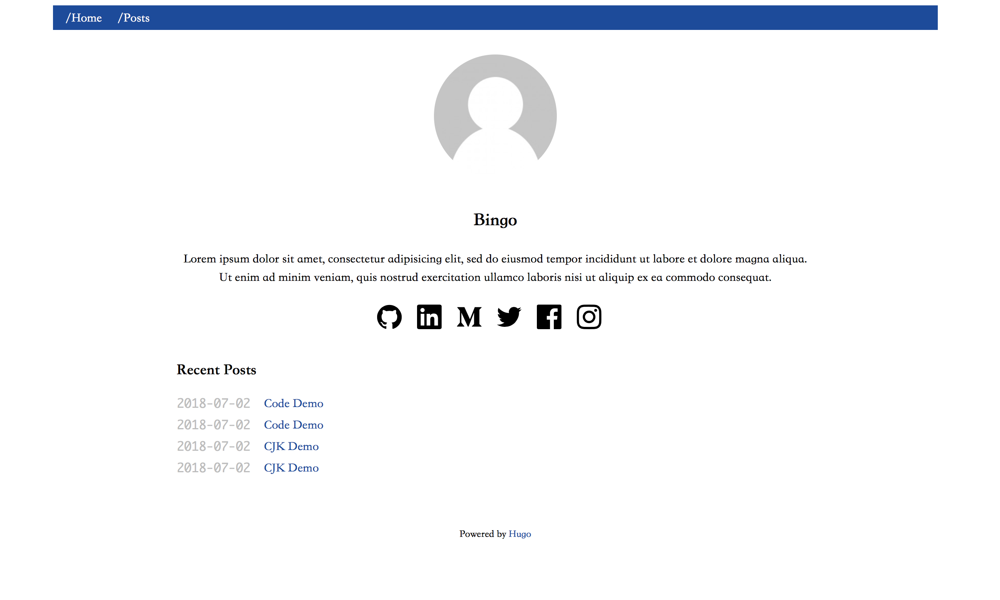
できた。

Netlify CMSのヘルプページには「netlify identityのウィジェットをheadに追記せよ」とあるので、そうしましょう。
下記のようにhead.htmlの6行目に入れてみました。
```html:hugo-bingo/layouts/partial/head.html
<head>
    <meta charset="utf-8">
    <meta name="viewport" content="width=device-width, initial-scale=1, shrink-to-fit=no">
    <title>{{ with .Page.Title }}{{ . }} - {{ end }}{{ .Site.Title }}</title>
    <base href="{{ .Site.BaseURL }}">
    <script src="https://identity.netlify.com/v1/netlify-identity-widget.js"></script>
    <link rel="stylesheet" href="{{ "css/normalize.min.css" | absURL }}">
    <link rel="stylesheet" href="{{ "css/solarized-light.min.css" | absURL }}">
    <link rel="stylesheet" href="{{ "css/style.css" | absURL }}">
</head>

```


早速GitHubにpushしてみます。

```bash
netlifycms_dir> git add .
netlifycms_dir> git commit -m "themeをhugo-bingoに変更"
netlifycms_dir> git push origin master
```

GitHubにpushすると、それを検知してNetlifyで自動デプロイしてくれます。デプロイが終わってからサイトのURLを叩くと無事サイトが表示されました。

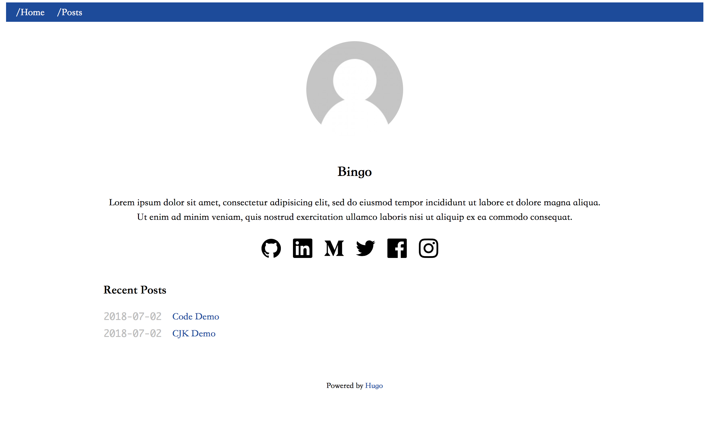

CMS管理画面にもログインしてみます。
URLは「`hoge.com/admin/`」です。

ログイン画面が表示され、netlify identityでログインせよと言われますね。netlifyのアカウントでログインを試みるが、弾かれます。

結論から言うと、netlify identityのアカウントとnetlifyのアカウントは別物です。netlifyの管理画面からパスワードリセットのメールが送信できるので、そこからパスワードを設定しましょう。

サイト管理画面から「Identyty」を選び、
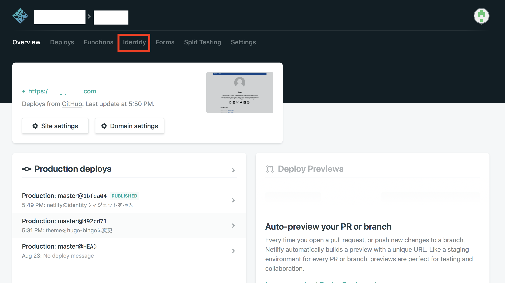

自分のidentityをクリック
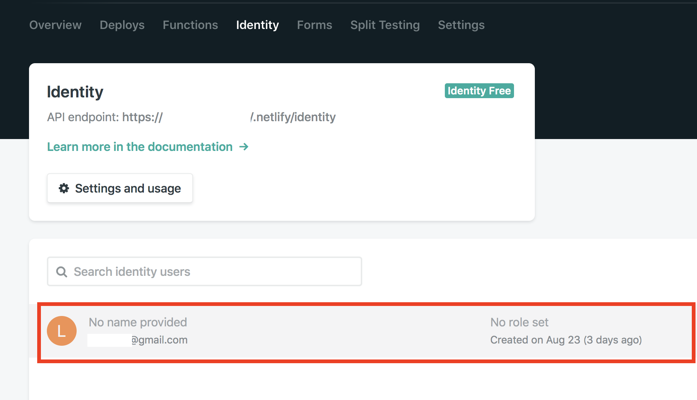

Send reset password emailをクリック
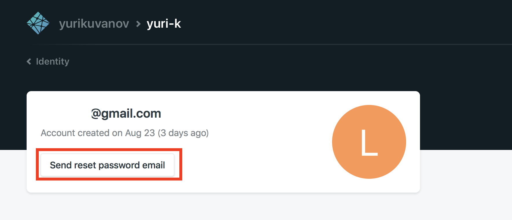

送信されてきたメールに記載のURLにアクセスするとパスワード変更できる
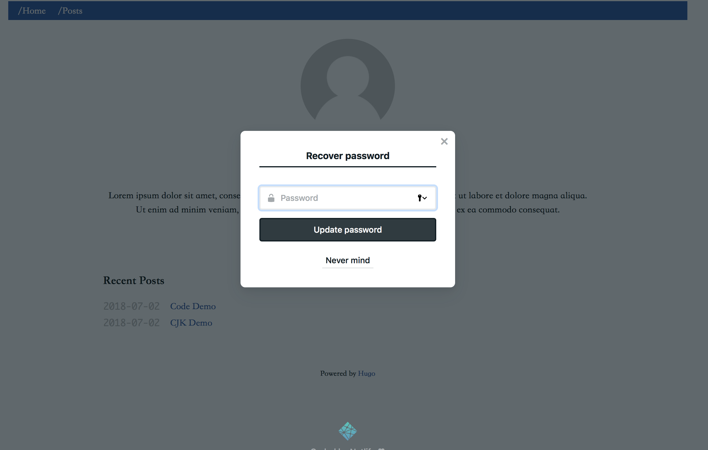


ログインできました。

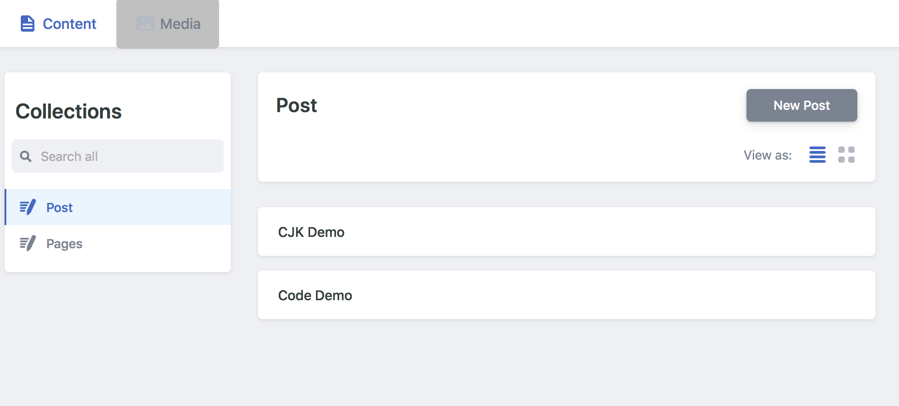

