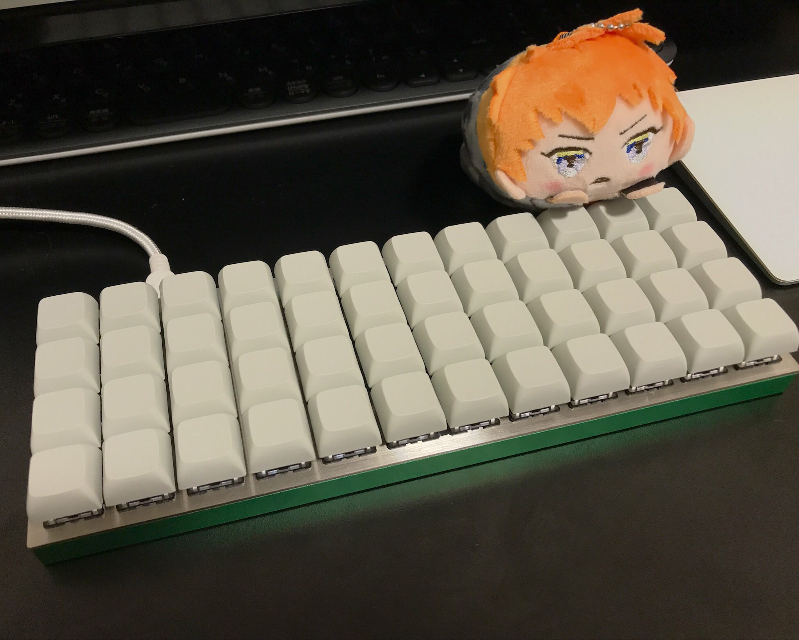

Planck Keyboardというキーボード組み立てキットを今年はじめにMassdropというサイトで購入しました。6月ごろに受け取ったまま放置していたのですが、この度ようやく組み立てることができました。

Planckの詳細や組み立て方はこちらの記事が詳しく、参考にさせていただきました。

http://okapies.hateblo.jp/entry/2017/03/26/063136

実際に組み立て終わったところ。

 

Planckはqmk_firmwareでキーマッピングを自由に入れ替えられるのがメリットです。

qmk_firmwareのインストール方法は下記のブログ記事を参考にさせていただきました。

http://leopardgecko.hatenablog.com/entry/2017/09/13/234549

ただ、記事ではkeymap.cのみを新しいキーマップのディレクトリにコピーしていますが、私の場合はrules.mkも合わせて移さないとうまくいきませんでした。また、最後のmakeの部分はqmk_firmwareの仕様が変わっており、下記のようにしました。


```bash
qmk_firmware> make planck/rev4:YOURKEYMAPDIR:dfu
```

```
/* Qwerty
 * ,-----------------------------------------------------------------------------------.
 * | Esc  |   Q  |   W  |   E  |   R  |   T  |   Y  |   U  |   I  |   O  |   P  | Bksp |
 * |------+------+------+------+------+-------------+------+------+------+------+------|
 * | Ctrl |   A  |   S  |   D  |   F  |   G  |   H  |   J  |   K  |   L  |   ;  |  "   |
 * |------+------+------+------+------+------|------+------+------+------+------+------|
 * | Shift|   Z  |   X  |   C  |   V  |   B  |   N  |   M  |   ,  |   .  |   /  |Enter |
 * |------+------+------+------+------+------+------+------+------+------+------+------|
 * | Tab  | Ctrl | Alt  | GUI  |Lower(英数)| Space |Raise(かな)| Left | Down | Up |Right|
 * `-----------------------------------------------------------------------------------'
 */
[_QWERTY] = LAYOUT_planck_grid(
    KC_ESC,  KC_Q,    KC_W,    KC_E,    KC_R,    KC_T,    KC_Y,    KC_U,    KC_I,    KC_O,    KC_P,    KC_BSPC,
    KC_LCTL,  KC_A,    KC_S,    KC_D,    KC_F,    KC_G,    KC_H,    KC_J,    KC_K,    KC_L,    KC_SCLN, KC_QUOT,
    KC_LSFT, KC_Z,    KC_X,    KC_C,    KC_V,    KC_B,    KC_N,    KC_M,    KC_COMM, KC_DOT,  KC_SLSH, KC_ENT ,
    KC_TAB, KC_LCTL, KC_LALT, KC_LGUI, LT(_LOWER,KC_LANG2),   KC_SPC,  KC_SPC,  LT(_RAISE,KC_LANG1),   KC_LEFT, KC_DOWN, KC_UP,   KC_RGHT
),

/* Lower
 * ,-----------------------------------------------------------------------------------.
 * |   ~  |   !  |   @  |   #  |   $  |   %  |   ^  |   &  |   *  |   (  |   )  | Bksp |
 * |------+------+------+------+------+-------------+------+------+------+------+------|
 * | Del  |  F1  |  F2  |  F3  |  F4  |  F5  | Left | Down |  Up  |Right |   {  |   }  |
 * |------+------+------+------+------+------|------+------+------+------+------+------|
 * |      |  F7  |  F8  |  F9  |  F10 |  F11 |  F12 |ISO ~ |ISO | | Home | End  |      |
 * |------+------+------+------+------+------+------+------+------+------+------+------|
 * |      |      |      |      |      |             |      | Next | Vol- | Vol+ | Play |
 * `-----------------------------------------------------------------------------------'
 */
[_LOWER] = LAYOUT_planck_grid(
    KC_TILD, KC_EXLM, KC_AT,   KC_HASH, KC_DLR,  KC_PERC, KC_CIRC, KC_AMPR,    KC_ASTR,    KC_LPRN, KC_RPRN, KC_BSPC,
    KC_DEL,  KC_F1,   KC_F2,   KC_F3,   KC_F4,   KC_F5,   KC_LEFT, KC_DOWN, KC_UP,   KC_RGHT, KC_LCBR,   KC_RCBR,
    _______, KC_F7,   KC_F8,   KC_F9,   KC_F10,  KC_F11,  KC_F12,  S(KC_NUHS), S(KC_NUBS), KC_HOME, KC_END,  _______,
    _______, _______, _______, _______, _______, _______, _______, _______,    KC_MNXT,    KC_VOLD, KC_VOLU, KC_MPLY
),

/* Raise
 * ,-----------------------------------------------------------------------------------.
 * |   `  |   1  |   2  |   3  |   4  |   5  |   6  |   7  |   8  |   9  |   0  | Bksp |
 * |------+------+------+------+------+-------------+------+------+------+------+------|
 * | Del  |  |   |   {  |   }  |   _  |   +  |  F6  |   -  |   =  |   [  |   ]  |  \   |
 * |------+------+------+------+------+------|------+------+------+------+------+------|
 * |      |  F7  |  F8  |  F9  |  F10 |  F11 |  F12 |ISO # |ISO / |Pg Up |Pg Dn |      |
 * |------+------+------+------+------+------+------+------+------+------+------+------|
 * |      |      |      |      |      |             |      | Next | Vol- | Vol+ | Play |
 * `-----------------------------------------------------------------------------------'
 */
[_RAISE] = LAYOUT_planck_grid(
    KC_GRV,  KC_1,    KC_2,    KC_3,    KC_4,    KC_5,    KC_6,    KC_7,    KC_8,    KC_9,    KC_0,    KC_BSPC,
    KC_DEL,  KC_PIPE,   KC_LCBR,   KC_RCBR,   KC_UNDS,    KC_PLUS,   KC_F6,   KC_MINS, KC_EQL,  KC_LBRC, KC_RBRC, KC_BSLS,
    _______, KC_F7,   KC_F8,   KC_F9,   KC_F10,  KC_F11,  KC_F12,  KC_NUHS, KC_NUBS, KC_PGUP, KC_PGDN, _______,
    _______, _______, _______, _______, _______, _______, _______, _______, KC_MNXT, KC_VOLD, KC_VOLU, KC_MPLY
),
```