iPhone XS MaxはiPhone史上最大の画面サイズを誇るナイスでグレートな端末ですが、本体重量もiPhone史上最大ということで、個人的には重いケースはもう無理！という心境です。手帳型ケースなどもってのほかですが、衝撃吸収系の複合素材ケースも結構しんどい感じです。

そんな事情があり、前々から気になっていたTotalleeというメーカーのiPhone XS Maxケースを3種類ほど購入してみました。

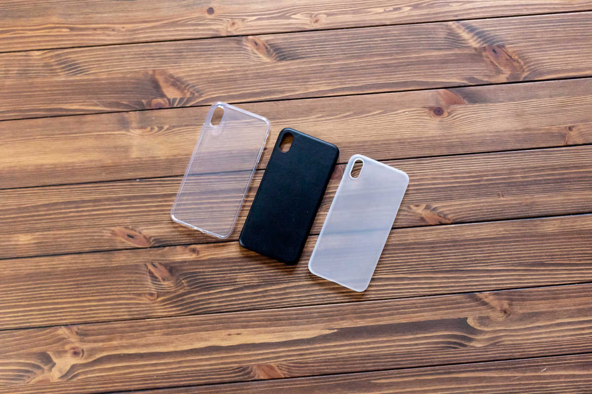

# とにかく薄さ・軽さ重視のTotalleeケース

Totalleeは米国でスマートフォンケースを中心としたアクセサリーを手がけるスタートアップです。9to5Macなどでよく記事広告を出していますね(私もそれで知りました)。

Totallee製ケースの最大の特徴は、とにかく薄いこと。ブランドロゴなどの装飾もなく、非常にミニマリスティックなデザインとなっています。

価格は20〜40ドル程度と、極端に安くも高くもないという設定。ただ、メールマガジンに登録しているとよく割引クーポンが送られてきます。今回、なんと70%オフというびっくり割引率のクーポンが来たので、ちょうどiPhone XS Max向けの軽量なケースが欲しかったこともあり、3つほど注文してみました。25ドルのケース2つに29ドルのケース1つで小計は23.7ドル。やしー！！

納期ですが、発注したのが9月29日で、送料11.99ドルの標準的な国際発送のプランで到着は10月16日。ちなみにポスト投函でした。

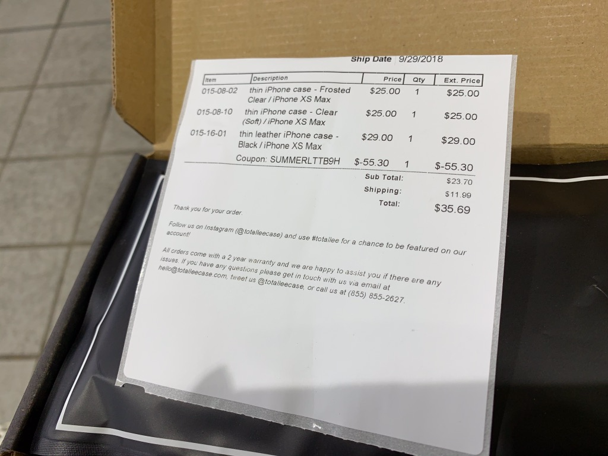

# 最薄を求める人のための「Matte」

totalleeのケースは大きく分けて「Matte」「Glossy」「Leather」の3種類をラインアップしています。

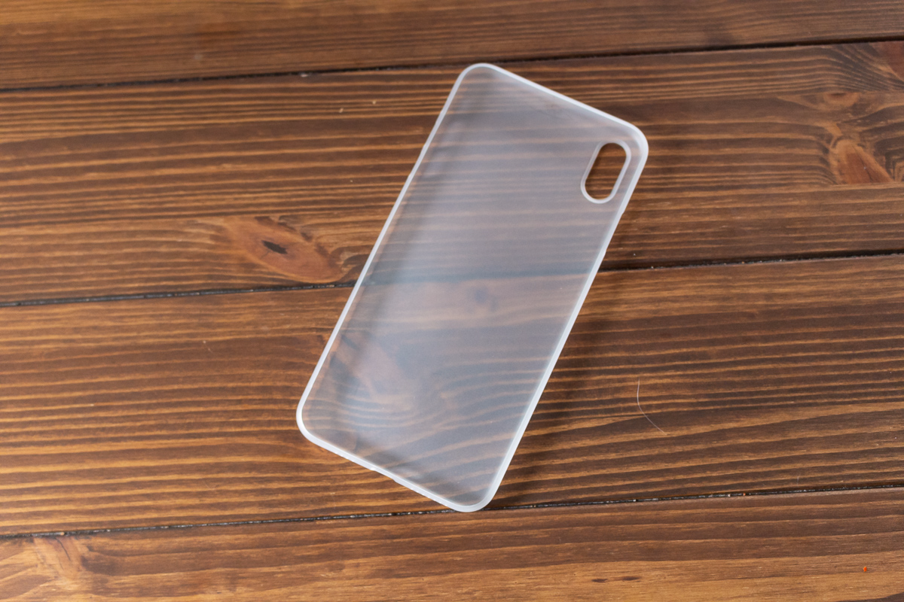

まずMatteですが、ポリカーボネート素材を用いた非常に薄いケースで、標準価格は25ドル。全ラインアップ中最も薄い0.5mm厚となっています。どのくらい薄いかというと、透明のケースではないにも関わらず、iPhone背面のAppleロゴやIPhoneロゴが透けるほどです。付けた状態のサイズ感はほとんど裸のiPhoneと変わらない印象です。

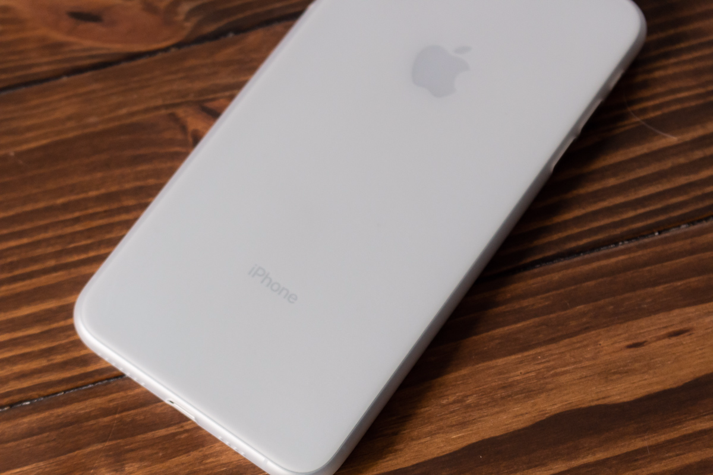
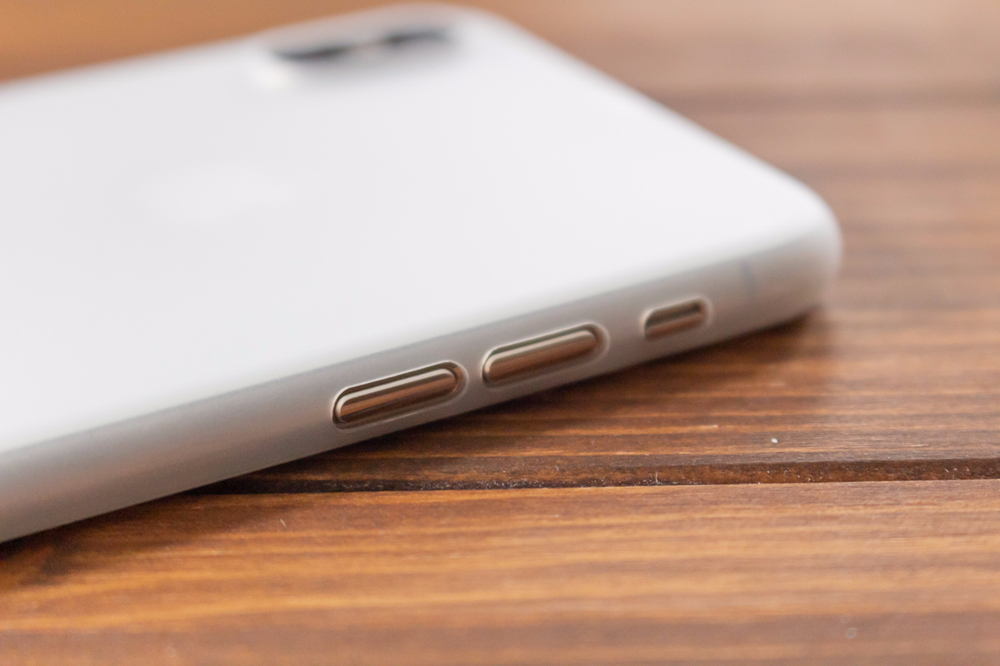
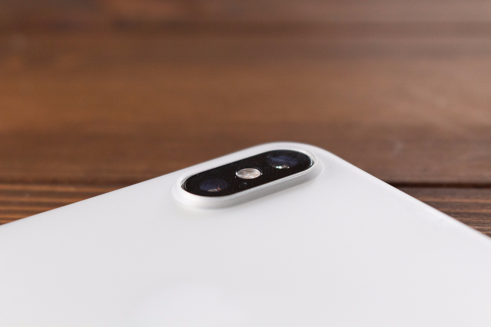

もちろん、本体の保護という意味では、擦り傷防止という意味では一定の効果はありそうですが、地面に落とした際の保護という意味でははなはだ頼りないです。

私が注文したカラバリ「Frosted White」はスベッとした良い手触りなのですが、グリップ感という意味ではやや頼りなく、何かの拍子に落としてしまいそうです。

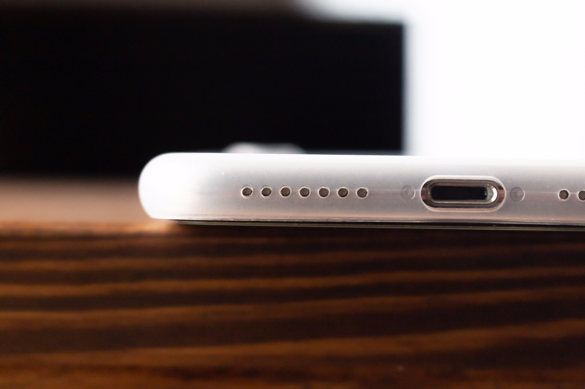
下部のスピーカー用パンチ穴は微妙にずれていたりします。

# コスパの高い本革ケース「Leather」

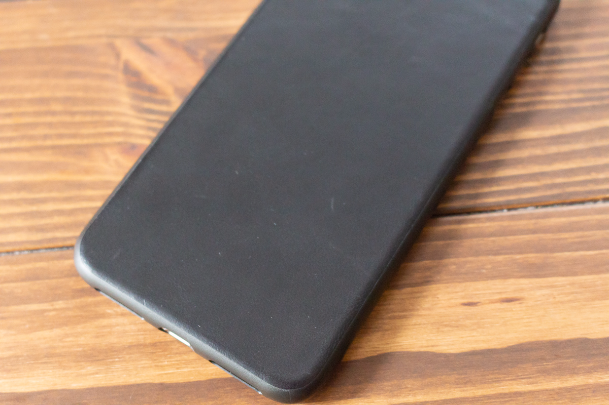

「Leather」は、背面に本革をあしらったケースで、標準価格は他のラインアップよりもやや高価な29ドル。ただし、私が購入したバージョンはすでにディスコンになっており、現在は39ドルの新型Leatherケースが新たに登場しています。仕様も微妙に変化しているようです。

革の質感は非常に良く、高級感がある外観。

ケースの厚さは、公式サイトで旧バージョンの記載が消えているのでなんともいえないのですが、背面・側面ともに明らかにMatteよりは厚いです。とはいえ薄型・軽量であることは間違いなく、ケースをつけた状態だと裸よりもやや大きくなったかな？とは感じますが、重量感はほとんど変わらない印象です。

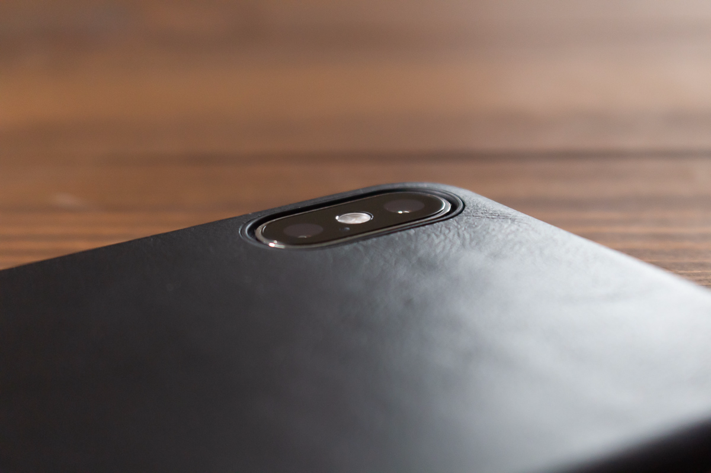

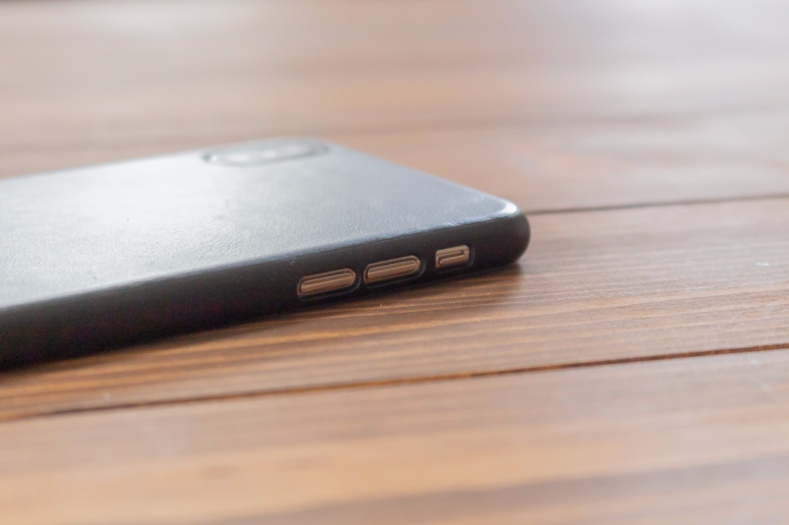

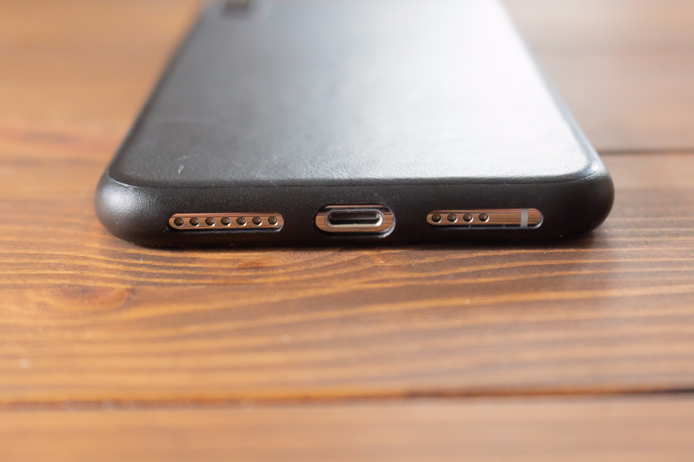

背面の革のおかげで指への吸い付きもよく、グリップ感は非常に良いです。おそらくツルッと滑って手から脱落することも少なくなるのではないでしょうか。

ケースがやや厚い分、保護性能もMatteよりは良さそうです。

# TPU製でソフトな「Glossy Clear」

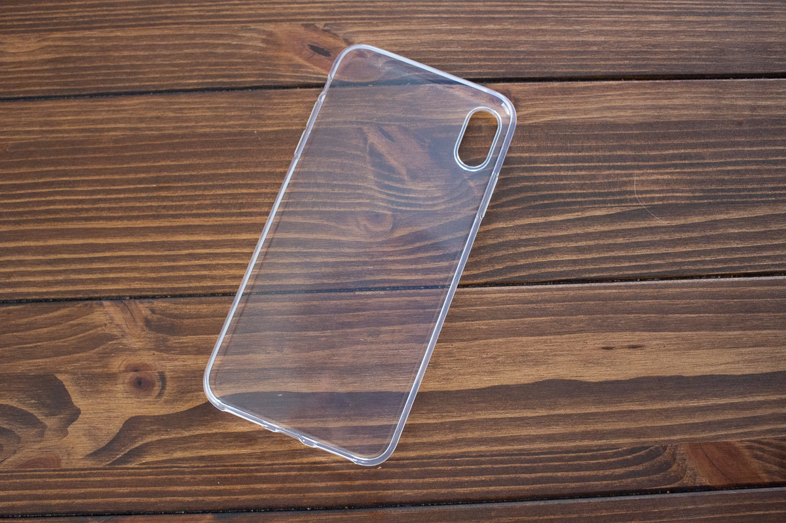

「Glossy」ケースは光沢感のあるケースで、25ドル。私は透明な「Clear(Soft)」を購入しましたが、素材はTPUで柔らかいタイプのケースでした。「Clear(Soft)」以外にも透明ではないタイプがラインアップされており、そちらの素材は異なるかもしれません。

「Glossy Clear」に関していえば、ごく普通のTPUクリアーケースといった印象。正直、100円ショップに売っていそうなケースです。TPUケースとしては薄型なので、少しでも薄いものが欲しい人には良さそうですが、25ドルという金額はちょっと高いかな、と感じました。

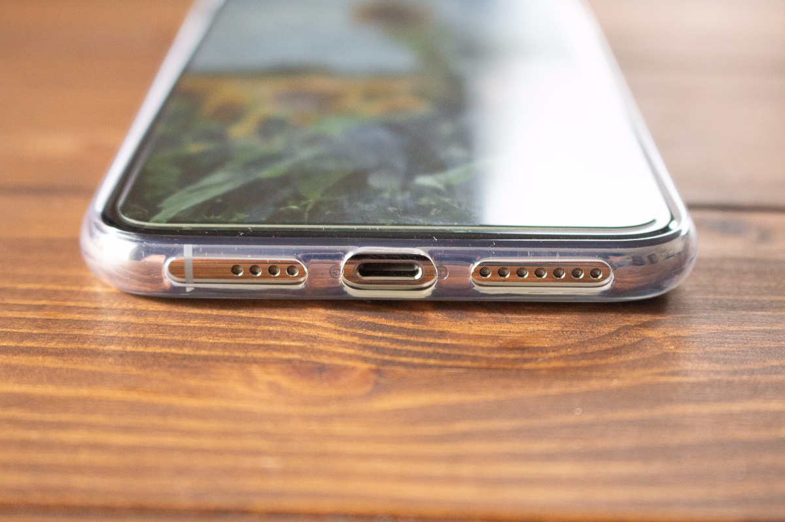
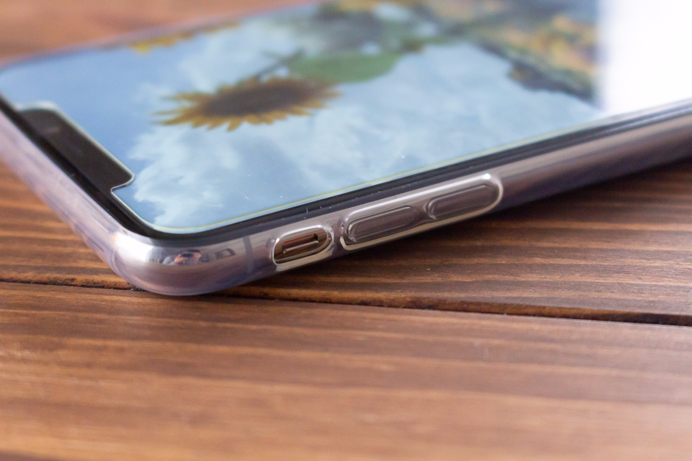
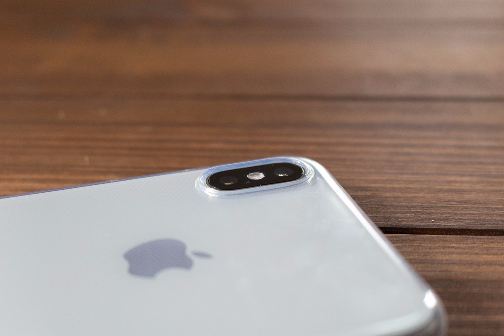

# 品質はそこそこだがクーポン適用でのお得感が高いケース

以上、購入した3種をざっと紹介してきましたが、私は現在「Leather」を常用しています。十分に軽く、薄く、レザーの質感とグリップ感が気に入りました。

正直、LeatherケースはLeather部分とプラスチック部分の継ぎ目がやや空いている箇所があったり、Matteケースもスピーカー開口部が微妙にずれていたりと、品質管理がやや甘い部分があります。

ただ、それを差し引いても、クーポンを適用することで、この薄さ、軽さ、品質のケース3つが送料込みでも4000円程度で手に入るというのは非常にコスパが高く感じました。特に本革のケースは、そこそこ高価な割に経年劣化で使えなくなる場合が多いので、気に入った場合はクーポンで安く購入できるときにまとめ買いしておくのも良さそうです。

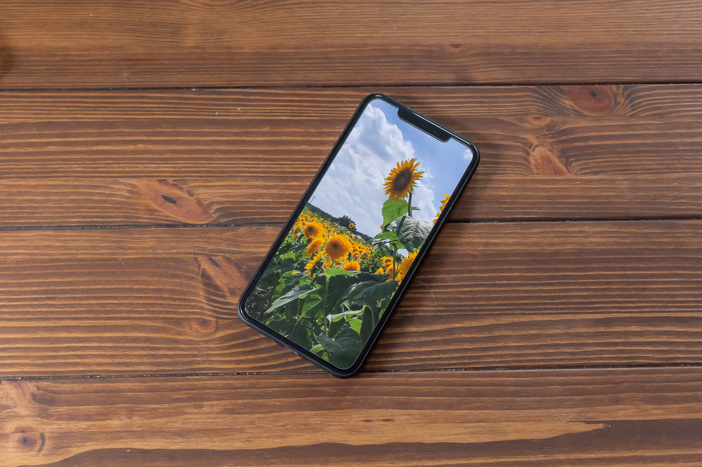